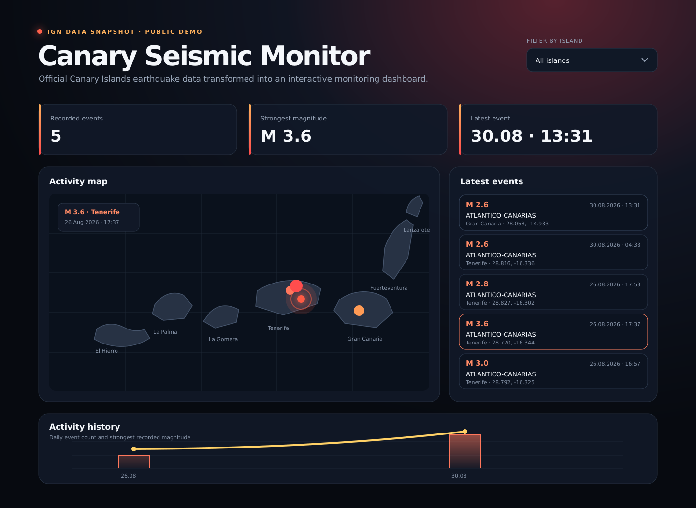
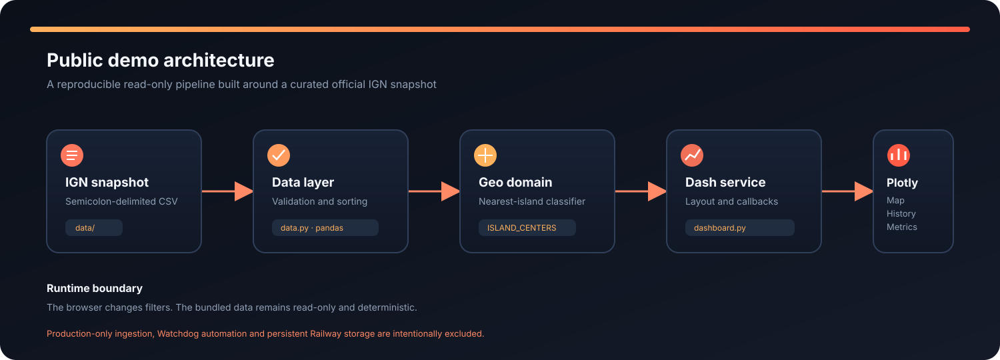

# Canary Seismic Monitor — Public Demo


An interactive Dash dashboard for exploring a curated snapshot of official earthquake data from Spain's **Instituto Geografico Nacional (IGN)** around the Canary Islands.

This repository is the public portfolio edition of a larger automated monitoring system developed by **Everyday Automated**.



## Project overview

The dashboard transforms a normalized CSV dataset into an interactive view of seismic activity across the Canary archipelago. Visitors can inspect recent events, compare magnitudes, filter the map by island and explore daily activity history.

The public repository uses a fixed snapshot of real IGN data. This makes the demo reproducible while keeping the production ingestion and persistence layer private.

## Features

- interactive Plotly earthquake map;
- magnitude-based marker size and colour;
- static highlight around the newest epicentre;
- geographic classification by nearest Canary Island;
- filtering by island;
- latest-event cards with official source links;
- event count and strongest-magnitude metrics;
- daily activity history;
- responsive Dash interface;
- pytest test suite;
- GitHub Actions continuous integration;
- Docker support.

## Architecture



The repository is divided into data, visualization, presentation and orchestration layers. See [the architecture document](docs/ARCHITECTURE.md) for the module responsibilities, runtime sequence, CSV contract and public/private boundary.

## Public demo and production edition

| Capability | Public demo | Private production edition |
| --- | --- | --- |
| Interactive dashboard | Yes | Yes |
| Official IGN data | Fixed snapshot | Automatically refreshed |
| Island filtering | Yes | Yes |
| Latest epicentre highlight | Yes | Yes |
| CSV processing | Read-only sample | Persistent history |
| Background ingestion | No | Yes |
| Watchdog change detection | No | Yes |
| Railway persistence | No | Yes |

## Technology stack

- Python 3.12+
- Dash
- Plotly
- Pandas
- CSV
- pytest
- uv
- Docker
- GitHub Actions

## Project structure

```text
canary-seismic-monitor-demo/
|-- .github/workflows/      GitHub Actions test workflow
|-- assets/                 Dashboard styles
|-- data/                   Curated IGN CSV snapshot
|-- docs/                   Architecture and visual documentation
|-- src/canary_demo/
|   |-- components.py       Reusable Dash UI components
|   |-- dashboard.py        Application composition and callbacks
|   |-- data.py             CSV validation and island classification
|   `-- figures.py          Plotly map and history builders
|-- tests/                  Automated tests
|-- app.py                  Application entry point
|-- Dockerfile              Container definition
|-- pyproject.toml          Project metadata and dependencies
`-- uv.lock                 Reproducible dependency lockfile
```

## Requirements

- Python 3.12 or newer
- [uv](https://docs.astral.sh/uv/)

## Run locally

Clone the repository:

```bash
git clone https://github.com/everyday-automated/canary-seismic-monitor-demo.git
cd canary-seismic-monitor-demo
```

Install the dependencies:

```bash
uv sync
```

Start the dashboard:

```bash
uv run python app.py
```

Open:

```text
http://127.0.0.1:8050
```

## Tests

Run the test suite:

```bash
uv run pytest -q
```

GitHub Actions runs the same test suite after every push and pull request.

## Docker

Build the image:

```bash
docker build -t canary-seismic-monitor-demo .
```

Run the container:

```bash
docker run --rm -p 8050:8050 canary-seismic-monitor-demo
```

Open `http://127.0.0.1:8050`.

## Data source

The bundled CSV contains a curated snapshot of real events published by the official **Instituto Geografico Nacional (IGN), Spain** earthquake catalogue:

https://www.ign.es/web/ign/portal/sis-catalogo-terremotos

The event identifiers, coordinates, timestamps and magnitudes remain attributable to IGN. This repository is an independent portfolio project and is not an official IGN service.

## Demo limitations

- The bundled data does not update automatically.
- The public demo does not persist new events.
- The live ingestion and Watchdog automation remain in the private production repository.
- The fixed snapshot does not need a periodic browser refresh; callbacks run only when the island filter changes.

## Status

The public demo is ready for local execution and container deployment. A hosted Railway link will be added after the production service is published.
